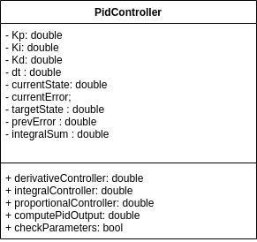

[](https://app.travis-ci.com/mahimaarora2208/PID_Controller_TDD)
[](https://coveralls.io/github/mahimaarora2208/PID_Controller_TDD?branch=master)
---
## ENPM808X Software Development for Robotics: PID Controller with TDD
## Author
Part1:
- Mahima Arora (Driver1) [Github Link](https://github.com/mahimaarora2208)
- Harika Pendli (Navigator1) [Github Link](https://github.com/harika-pendli)

Part2:
- Badri (Driver2) [Github Link](https://github.com/Irdab2000)
- Shelvin Pauly(Navigator2) [Github Link](https://github.com/spauly98)

## UML Diagram
<p align="center">

</p>

## Overview

Repository for a simple PID Controller implementation using:
- cmake
- googletest
- Travis
- Coveralls
- Doxygen
- Google C++ Styling

## Standard install via command-line
```
git clone --recursive https://github.com/mahimaarora2208/PID_Controller_TDD
cd <path to repository>
mkdir build
cd build
cmake ..
make
Run tests: ./test/cpp-test
Run program: ./app/shell-app
```

## Building for code coverage (lcov)

sudo apt-get install lcov 
cmake -D COVERAGE=ON -D CMAKE_BUILD_TYPE=Debug ../
make
make code_coverage

This generates a index.html page in the build/coverage sub-directory that can be viewed locally in a web browser.

There is a coverage folder which contains the output for repository.

## Design Review ##

A design review was done for the code by authors of Part 1

- Changes
  1. Added private member to class - prevError to store previous error to implement derivative controller.

- Suggestions
  1. File was not formatted with Cpplint and CppCheck

A design review was done for the code by authors of Part 2

- Changes
  1. Added two new private attributes - KiError and prev_erorr. KiError was to accumulate the integral error. prev_error was used to store the output of the previous state to be used to calculate derivative error.

  2. Modified test case for the function that computes the controller output.

- Suggestions
  1. Styling for code was not according to Google C++ Style. 


## Working with VSC

In your VSC, open the repository you cloned in the steps mentioned above.

```
cd <path to repository>
mkdir build
cd build
cmake ..
make
Run tests: ./test/cpp-test
Run program: ./app/shell-app
```
## Debug

1. Set breakpoint in source file (i.e. double click in the left margin on the line you want 
the program to break).

2. Click Run --> Start Debugging from the menu to hit the break point 
Local C/C++ Application, choose the binaries to run (e.g. shell-app).

3. If prompt to "Confirm Perspective Switch", select yes.

4. Program will break at the breakpoint you set.

5. Press Step Into (F5), Step Over (F6), Step Return (F7) to step/debug your program.

7. Press Terminate by clicking 'X' on the top or hit ctrl + C on terminal.

## Plugins
- Google C++ Sytle
```
  clang-format -style=Google -i your_file.cpp
```

- Cpplint
```
# You may need to install cpplint:
sudo apt install python3-pip
pip install cpplint

# read the cpplint manual to get an idea of what it does:
~/.local/bin/cpplint -h
#to run on a file:
cpplint "FIlename.cpp"
```

- cppCheck
```
cppcheck --enable=all --std=c++11 -I include/ --suppress=missingIncludeSystem $( find . -name *.cpp | grep -vE -e "^./build/" -e "^./vendor/" )
```
